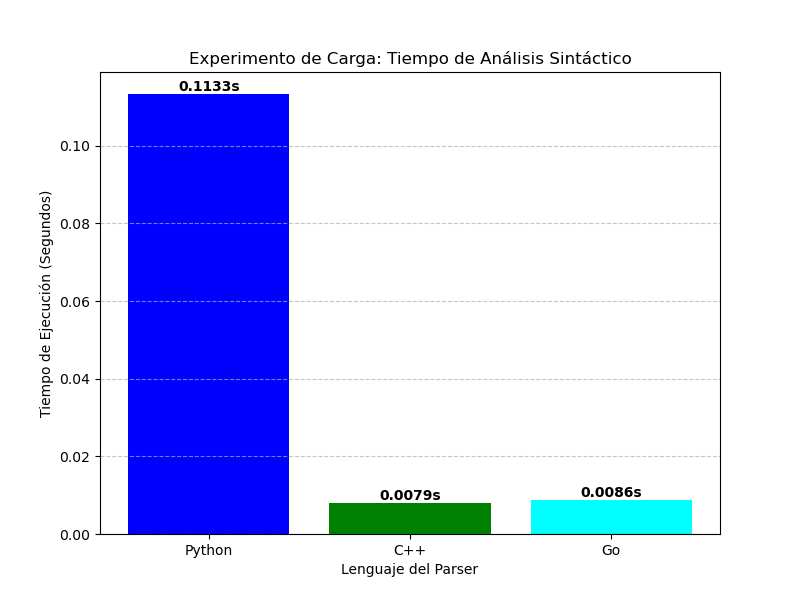

# UnegScript Hybrid Programming Assistant

Este proyecto implementa un asistente de programación híbrido para un subconjunto de Python llamado **UnegScript**. El sistema combina técnicas tradicionales de compilación (análisis léxico con expresiones regulares y análisis sintáctico descendente recursivo) con inteligencia artificial basada en distancia de Levenshtein y simulación de LLM para corregir errores tipográficos y sugerir correcciones.

## Características

## Actividad 4: Benchmark Multi-lenguaje con ANTLR4

En esta actividad se implementó un analizador léxico y sintáctico para el formato de archivos `/etc/network/interfaces` de Debian utilizando el metacompilador **ANTLR4**. El objetivo principal fue realizar un experimento de carga para comparar el rendimiento de los parsers generados en diferentes lenguajes de programación.

### Características de la Actividad 4
- **Gramática ANTLR4**: Definición formal en `Interfaces.g4` para procesar configuraciones de red.
- **Implementaciones**: Se generaron y validaron analizadores en tres lenguajes:
  - **C++**: Localizado en `ACT_4/cpp/`.
  - **Go**: Localizado en `ACT_4/go/`.
  - **Python**: Localizado en `ACT_4/py/`.
- **Benchmark**:
  - Se utilizaron 15 archivos de prueba (`benchfiles/`) con diferentes niveles de complejidad.
  - El script `benchmark.py` automatiza la ejecución de los tres parsers y mide los tiempos de procesamiento.
  - **Resultados**: Los tiempos de ejecución se visualizan en `benchmark_resultados.png`, permitiendo comparar la eficiencia de cada runtime de ANTLR4.



#### Comandos usados para generar el codigo de cada lenguaje:
- **C++**: `antlr4 -Dlanguage=Cpp -o cpp Interfaces.g4`
- **Go**: `antlr4 -Dlanguage=Go -package main -o Go Interfaces.g4`
- **Python**: `antlr4 -Dlanguage=Python3 -o py Interfaces.g4`

---

## Actividad 5: UnegScript Hybrid Programming Assistant

Este proyecto implementa un asistente de programación híbrido para un subconjunto de Python llamado **UnegScript**. El sistema combina técnicas tradicionales de compilación con inteligencia artificial basada en distancia de Levenshtein y simulación de LLM para corregir errores tipográficos y sugerir correcciones.

### Características de la Actividad 5
- **Lexer híbrido**:
  - Reconoce tokens mediante expresiones regulares (keywords, identificadores, números, operadores, paréntesis, punto y coma, cadenas).
  - Si un token no coincide con ninguna regla (o es un identificador muy similar a una keyword), se calcula su similitud con las palabras clave usando la distancia de Levenshtein.
  - Si la confianza es ≥ 0.8, se corrige automáticamente; si es menor, se consulta una IA simulada.
- **Parser descendente recursivo con lookahead**:
  - Construye un AST (Abstract Syntax Tree) para representar la estructura del programa.
  - Si encuentra un error de sintaxis, consulta a la IA (simulada) para obtener una sugerencia de corrección.
- **Ejemplo de procesamiento**:
  - Entrada: `pront x = 5; if x > 3 prnt(x) else prnt("no")`
  - Salida: tokens corregidos, sugerencias léxicas, y (si es posible) el AST.

## Estructura de ACT_5
```bash
├── token.py # Definición de Token y constantes
├── levenshtein.py # Funciones de distancia y confianza
├── lexer.py # Analizador léxico híbrido
├── ast_nodes.py # Clases de nodos del AST
├── parser.py # Analizador sintáctico
├── main.py # Punto de entrada
└── README.md # Documentación
```


## Requisitos

- Python 3.6 o superior.
- No requiere librerías externas (usa solo `re` del estándar).

## Ejecución

1. Clona o descarga los archivos en una misma carpeta.
2. Abre una terminal en esa carpeta.
3. Ejecuta:
   ```bash
   python main.py
   ```
